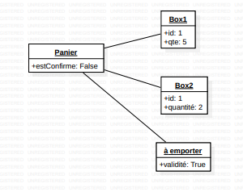
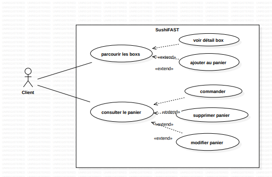
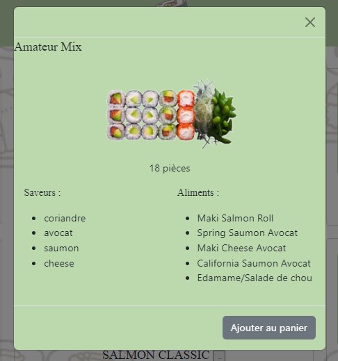
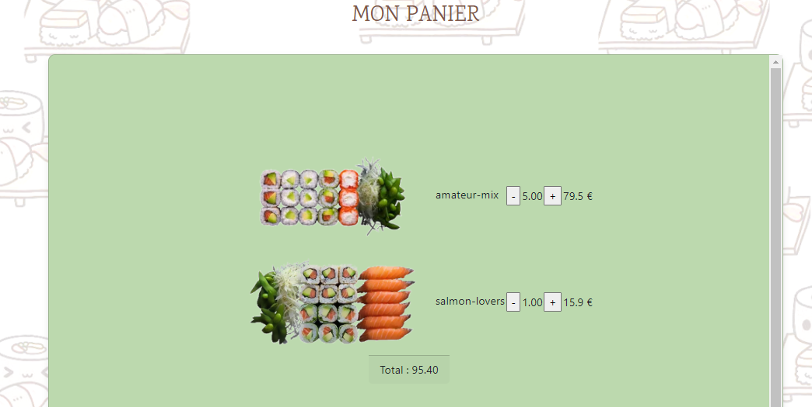

 
= Sushi App
:toc:
:toclevels: 4

== Projet 
Du 12/02/2024 au 30/04/2024

=== présentation

Dans le cadre de notre projet SushiApp, l'objectif était de nous permettre d'apprendre l'utlisation de Angular, pratiquer du Javascript et d'utiliser une API pour réaliser une application de commande à https://sheinezbenbk.github.io/Sushi-App/[Sushi].

=== introduction

Premièrement, nous avons réalisé une maquette avec des consignes précises pour nous donner un apercu du site dans lequel nous allons pouvoir la réaliser et mettre en place le travail sur le site.

.premières tâches à réaliser  
====

- https://www.figma.com/file/rwZNgQe0MLPi9UkKCik6js/Maquette?type=design&node-id=0-1&mode=design&t=C95EC6l34hnV6ayB-0[la maquette]
- strucuture JSON
- diagramme des cas d'utilisateur
====

Avant de débuter notre première page de code, nous avons tout d'abord créé un service, ce qui va nous permettre d'instancier nos box et de les utiliser par la suite dans notre site.

[source, javascript]
----
export class SushiBoxService {
constructor(private http:HttpClient) { }
public Box(): Observable<any> {
let resultat =this.http.get(environment.apiBaseUrl);
console.log(resultat)
return resultat;
}
}
----

== Création du site

Pour la  page principale ou nous allons trouver toutes les box à Sushi et c'est aussi la page où nous allons pouvoir sélectionner pour les ajouter dans notre panier.

[source, html]
----
        

          

            

              
            

          

          

            

              
{{boxDetail?.pieces}} pièces

            

          

          

            

              
Saveurs :

              <ul>
                <li *ngFor="let saveur of boxDetail?.saveurs ?? []">{{ saveur }}</li>
              </ul>
            

            

              
Aliments :

              <ul>
                <li *ngFor="let aliment of boxDetail?.aliments"> {{ aliment.nom }}  </li>            
              </ul>
            

        

        
        

          <button type="button" class="btn btn-secondary" data-bs-dismiss="modal" (click)="ajouterAuPanier(boxDetail!)">Ajouter au panier</button>
        

----

Dans ce code j'ai utilisé un modal issue de Bootstrap dans lequel j'ai implémenté mes méthodes que j'ai créé pour importer les détails de mes boîtes.

[source, typescript]
----
[...]
export class HomeComponent {

  boxDetail: Box | null
  boxes: Array<Box> = [] //création d'un tableau vide 

  constructor(private boxs: GetBoxService, private panierManager: PanierManagerService) {
    this.boxDetail = null

    this.boxs.getBox().subscribe((resultat) => {
      console.log(resultat);

      for (const uneBox of resultat) {
        // Création d'une nouvelle instance de Box en utilisant les données de uneBox
        let boxInstance = new Box(
          uneBox.id,
          uneBox.nom,
          uneBox.pieces,
          uneBox.prix,
          uneBox.image,

        );

        for (let aliment of uneBox.aliments) {
          let alimentInstance = new Aliment(aliment.nom, aliment.quantite);
          boxInstance.aliments.push(alimentInstance)
        }

        for (let saveur of uneBox.saveurs) {
          boxInstance.saveurs.push(saveur)
        }

        this.boxes.push(boxInstance);
      }
    });
  }

  onDetails(laBox: Box) {
    this.boxDetail = laBox
    console.log(this.boxDetail)
  }

  // Ajoute la box sélectionnée au panier
  ajouterAuPanier(uneBox: Box) {
    this.panierManager.addPanier(uneBox)
  }

  reduireAupanier(uneBox: Box) {
    this.panierManager.reduireAuPanier(uneBox)
  }
}
----

.résultat
====

====

=== Panier

lors de la création du panier, nous avons procéder de la même manière que la carte. 

* son service 

[source, typescript]
----

export class PanierManagerService {
  public panier: Array<Ligne>
  constructor() { 
    this.panier=JSON.parse(localStorage.getItem("lesBoxes") ?? "[]")
  }

  getPanier() {
    return this.panier
  
}

// Définition de la fonction setPanier qui prend un tableau d'objets de type Ligne en paramètre
setPanier(boxes: Array<Ligne>) {
  // Création d'une variable locale panier qui contient le contenu du tableau boxes
  let panier = boxes;

  // Stockage du contenu de panier dans le stockage local du navigateur sous la clé "lesBoxes"
  localStorage.setItem("lesBoxes", JSON.stringify(panier));
}

addPanier(uneBox:Box){
  this.getPanier()
  let avoirBox = false
  let quantite = 1
  let ligne=new Ligne(quantite,uneBox)
  for (const uneLigne of this.panier){
    if (uneLigne.uneBox.id == uneBox.id ){
      uneLigne.quantite++
      avoirBox=true
    }
  }

  if(avoirBox==false){
    this.panier.push(ligne)
  }
  console.log(this.panier)
  localStorage.setItem("lesBoxes", JSON.stringify(this.panier))
}

reduireAuPanier(uneBox:Box){
  let indexToRemove = -1;
  for (let i = 0; i < this.panier.length; i++) {
    if (this.panier[i].uneBox.id === uneBox.id) {
      if (this.panier[i].quantite > 1) {
        this.panier[i].quantite--;
      } else {
        indexToRemove = i;
      }
      break;
    }
  }

  if (indexToRemove !== -1) {
    this.panier.splice(indexToRemove, 1);
 
  }

  console.log(this.panier);
  localStorage.setItem("lesBoxes", JSON.stringify(this.panier));
}

totalPanier(){
  let total =0
  for (const ligne of this.panier){
    total+= ligne.uneBox.prix * ligne.quantite
  }
  return total
}
}
----

* sa mise en place

[source, html]
----
    

        <table >
            <tbody>
                <tr *ngFor="let ligne of monPanier">
                    <td>
                        {{ligne.uneBox.image}}
                    </td>
                    <td> <input type="button" value="-" (click)="reduireQuantite(ligne.uneBox)" /> </td>
                    <td> {{ligne.quantite | number: '1.2-2'}} </td>
                    <td> <input type="button" value="+" (click)="ajoutQuantite(ligne.uneBox)" /> </td>
                    <td> {{ligne.uneBox.prix * ligne.quantite}} €</td>
                </tr>
            </tbody>
        </table>
    

----

[source, typescript]
----
export class PanierComponent {
  monPanier: Array<Ligne>

  constructor(private panierManager: PanierManagerService) {
    // Utilisation du service PanierManagerService passé en paramètre pour initialiser une propriété monPanier
    // La méthode getPanier() du service est utilisée pour obtenir le panier
    this.monPanier = this.panierManager.getPanier()
  }
total(){
  return this.panierManager.totalPanier()
}

reduireQuantite(box: Box): void {
  // Récupérer la quantité actuelle de la boîte
this.panierManager.reduireAuPanier(box)
 
}

ajoutQuantite(box: Box): void {
  this.panierManager.addPanier(box)
}

}
----
Dans ce code, nous avons ajouté plusieurs méthodes  : 

- pour effacer le panier, 

- ajouter des box directement dans le panier  

- calculer le prix total du panier.

.résultat
====

====
